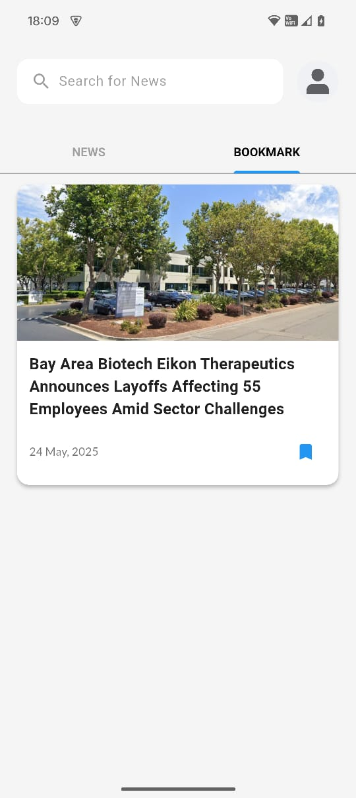
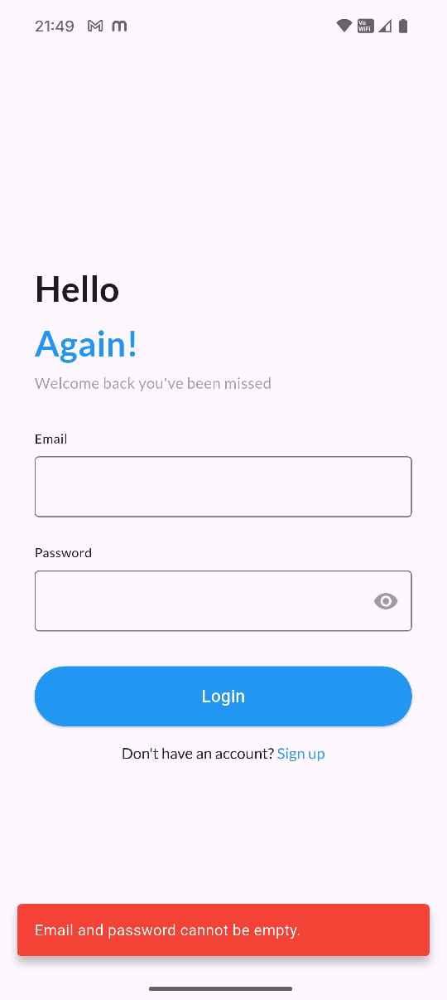
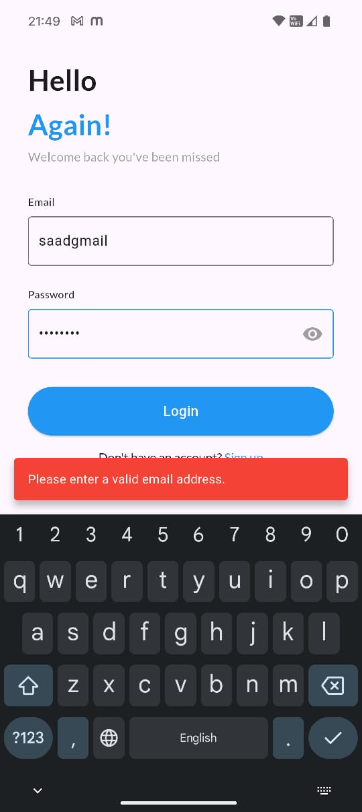
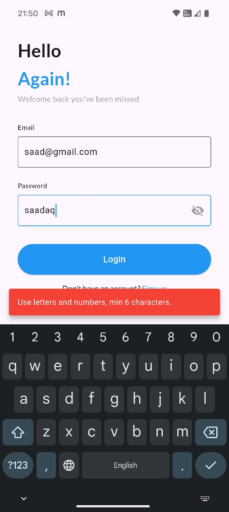
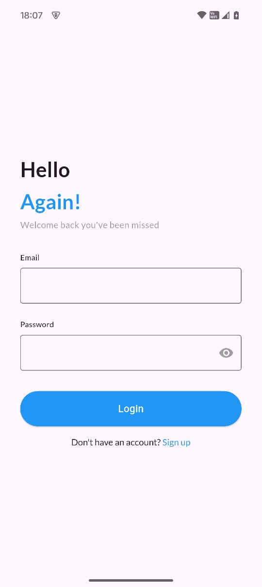
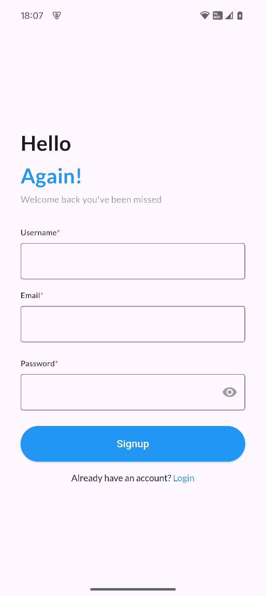
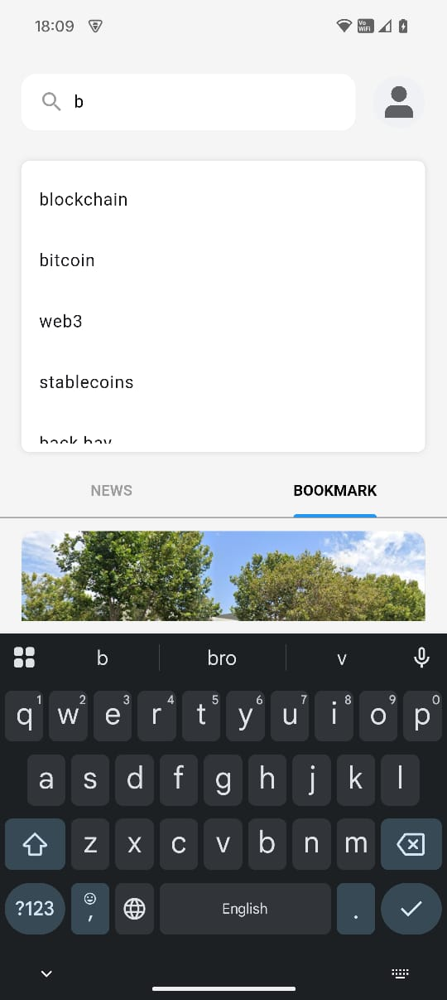

# NewsApp

A Flutter news application that fetches and displays the latest news articles.

---

## Setup Instructions

1. Clone the repository:
   ```bash
   git clone https://github.com/SaadMansuri7/News-Application-.git
2. Navigate into the project directory:
   ```bash
   cd News-Application-
3. flutter pub get
4. flutter run
5. Make sure Flutter SDK is installed and set up on your machine. For installation help, visit the Flutter documentation.


## Screenshots

 
 










## Architecture Choices

- **Flutter with Provider for state management:** Simple and efficient UI updates.
- **MVVM pattern:** Separates UI and logic for better maintainability.
- **HTTP package:** For fetching news articles from APIs.


## Third-Party Packages Used

| Package               | Purpose / Reason for Use                                         |
|-----------------------|-----------------------------------------------------------------|
| `webview_flutter`     | To embed web content directly inside the app using WebView      |
| `auto_route`          | Simplifies navigation and routing with automatic route generation|
| `get_it`              | Service locator for dependency injection and better code decoupling|
| `provider`            | State management to efficiently manage and update UI state      |
| `google_fonts`        | Easily use Google Fonts in your app for better typography       |
| `flutter_dotenv`      | Manage environment variables securely (e.g., API keys)          |
| `shared_preferences`  | Store simple persistent data locally (e.g., user settings)      |
| `http`                | Perform network requests to fetch data from APIs                |
| `intl`                | Internationalization and formatting for dates, numbers, etc.    |
| `cupertino_icons`     | Provides iOS-style icons for UI consistency                      |

---

### Dev Dependencies

| Package               | Purpose / Reason for Use                                         |
|-----------------------|-----------------------------------------------------------------|
| `flutter_test`        | Flutter’s built-in testing framework for writing unit/widget tests|
| `build_runner`        | Runs code generation tasks during development                    |
| `auto_route_generator`| Generates routing code automatically based on your route setup  |


**APK file:** [Download APK](https://drive.google.com/file/d/1_Gj4s5f8LcLZh1c7fvpD8wdeyKiRqHV6/view?usp=drivesdk)


**Watch Live Demo:** [Live Video](https://drive.google.com/file/d/1_Qn3lZwnsO5cw1ZAA4dxmUx9vb1CLM2A/view?usp=drivesdk)
